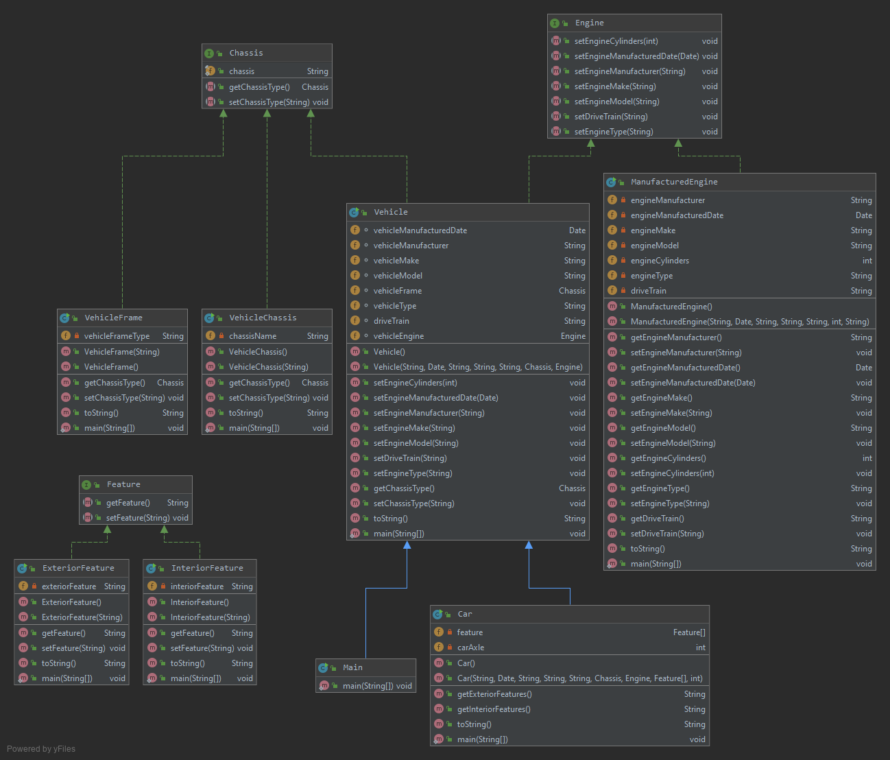

# Project Title
**OOP-Car-Project**

This car project is focuses on modeling business problems using java class, creating classes immutable, and user interfaces.
I created this project alone, this project was made for a assignment called Personal Project.
I made this program at FGCU for OOP.

## Documentation

[JavaDoc](https://lsze5821.github.io/OOP-Car-Project/)

## Diagrams
**Class Diagrams**

## Getting Started
Make sure that JRE is installed:
* Java version "1.8.x_xx" (or a higher version)

Clone from Github:
* Click on "Clone or download".
* Either Download the Zip file or clone the HTTPS.
* If you Download the Zip
* Unzip and open project in the IDE

Clone From IDE:
* File > New > Project From version control > Enter URL/HTTP > Choose the directory for project > clone

Creating Path to Database:
* Database tab > Plus sign > Data source from path > Choose directory for database (ex: Lib Folder) > h2 > test connection > apply
* Check the database password inside the properties folder.

Linking Jar file:
* File > Project structure > Modules > Dependencies > Find and Choose jar file > apply

## Built With
* Intelij

## Contributing
* Create a Gui to the program

## Author

* Louis Sze

## License

[BSD 3-Clause License](https://github.com/Lsze5821/OOP-Car-Project/blob/master/LICENSE)

## Acknowledgments
  **Oracle**
* Java Programming
* 2-1: Java Class Design - Interfaces

## History
Personal Project OOP Car Program
* 9/4/19 - 2 hours - Create an interface named Chassis.
* 9/11/19 - 2 hours - Create an interface Engine with the following list of public method definitions that return a void.
* 9/18/19 - 2 hours - Create a concrete class named VehicleChassis that implements the interface Chassis.
* 9/25/19 - 2 hours - Create a concrete class named ManufacturedEngine that implements the interface Engine.
* 10/2/19 - 2 hours - Create an interface Feature.
* 10/9/19 - 2 hours - Create a concrete class named InteriorFeature that implements the interface Feature.
* 10/16/19 - 2 hours - Work on whats not finished from previus days.
* 10/23/19 - 2 hours - Create a concrete class named ExteriorFeature that implements the interface Feature.
* 10/30/19 - 2 hours - Working on whats not finished and bug checks/fixing bugs.
* 11/6/19 - 2 hours - Create a concrete class named Vehicle that implements the Engine and Chassis interfaces.
* 11/13/19 - 2 hours - Working on whats not finished and bug checks/fixing bugs.
* 11/20/19 - 2 hours - Create a concrete class named Car that extends the Vehicle class.
* 11/27/19 - 2 hours - Review and edit.
* 12/4/19 - 2 hours - Final review and debug.
* 12/11/19 - Submit Personal Project.

## Key Programming Concepts Utilized

* Constructor - A specialized method that creates an instance of a class.
* Final - A keyword that qualifies a variable as a constant and prevents a method from being
overridden in a subclass.
* Immutable Class - A class that it can't be overridden by a subclass, in fact it can't be subclassed.
* Interface - Defines constants and methods without implementation

